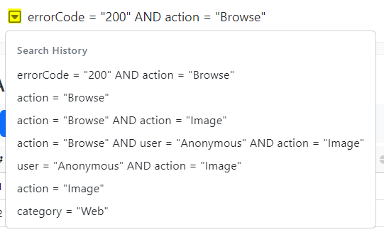
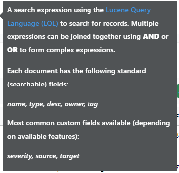
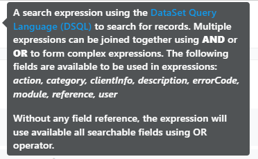
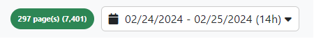
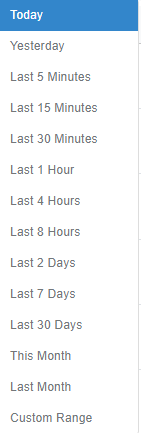
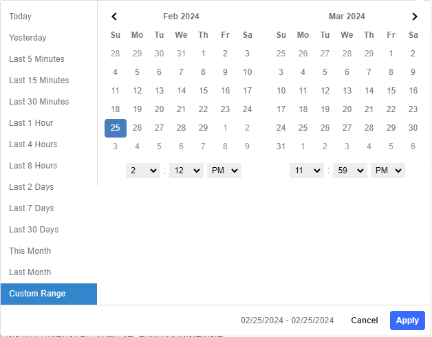

## Overview

The application workspace is divided in a few areas:

1. The application name and logo (the logo is clickable and takes the user to the application home)
2. The navigation area on the left allows users to open various dashboards available in the application
3. The search area allows users to query the current dashboard and filter the data displayed in the content area
4. The section displays the following information:
    * background activity
    * user information
    * application help
5. The content area
   

_Figure 1. Typical view of an application dashboard_

### Information Searching (Querying)

The search filed has dropdown button which can display previous searches, up to 10 entries.

  
_Figure 2. Typical view of an a search history_

The search field also displays a tooltip, which is different between dashboards, and it describes the format for the search expression (and a link to additional information) and available fields to be used in search expressions.

When the _Search_ dashboard is displayed, the query syntax is based on on Lucene Query Language (LQL) and provides access to a very flexible fulltext search engine:

  
_Figure 3. Typical view of a search tooltip for search engine_

For most dashboards, the query syntax is based on DataSet Query Language (DSQL) which allows for a set of most common comparison expressions:

  
_Figure 4. Typical view of a search tooltip for dashboards_

## Information Browsing

Most dashboards will display the information paginated (faster responses for large data sets) and in many cases a time filter is also available:

  
_Figure 5. Typical view of a pagination information and time filtering_

The time filter displays the selected time interval as `start day - end day (interval)` regardless of the selected time range (to reduce the size of the time filter). The interval uses current time as end of the interval for any interval smaller than 24h and after that it uses the end of the day. 

A predefined list of time ranges is available, which will allow the user to quickly select the desired time range without the need to enter a complete date/time range:

  
_Figure 6. Typical view of a time filtering presets_

For custom time ranges, the user can select _Custom Range_ option and select the start and end of the interval (date & time) manually:

  
_Figure 7. Typical view of a custom time range_

