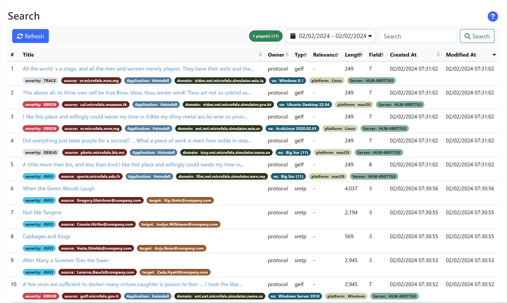
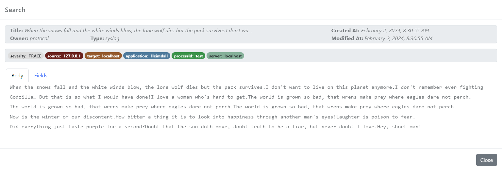
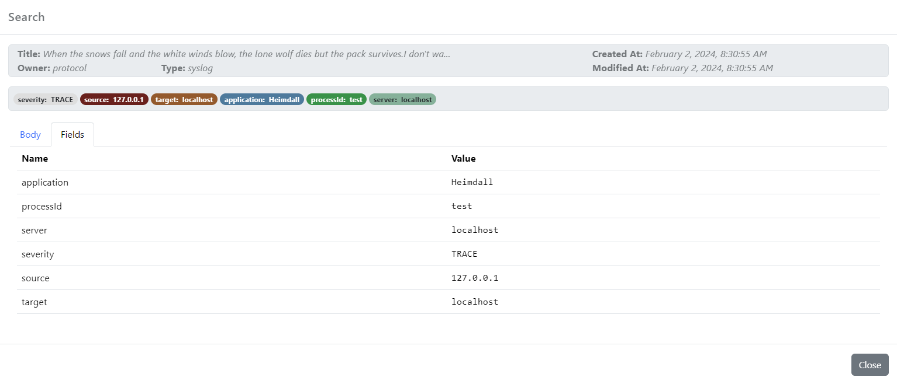

The _Search_ dashboard allows users to locate application data (documents) by entering keywords or phrases. The application uses a full-text search engine to support a range of queries, including a time range. 

_Figure 1. Typical view of the Search dashboard_

!!! warning
For performance reasons, the search engine refreshes periodically to load the newest document changes (default to 60 seconds). Documents added (or changed) since the last refresh are not available to the search engine.

## Fields

Each document has the following standard (searchable) fields:
* `name`: The name/title of the document
* `type`: The type of the document
* `desc`: The description associated with the document (optional)
* `owner`: The owner of the document (module/service)
* `tag`: The tags (keywords) associated with the document

Most common custom fields available (depending on available features):
* `severity`: The severity/important of the document
* `source`: The source of the document (producer)
* `target`: The target for the document (consumer/audience)

In addition to the standard fields above, documents can have any number of custom fields registered with the document. These fields are indexed and available to be searched.

Each document has a _body_, which is made out of the description associated with the document and the _body of text_ provided with the document. This field is the default field used during searching, unless the field is provided with the searched text.

Fields can be used to search through the document using a _query_ (search expression) as described bellow.

## Query

The search engine is built on top of Apache Lucene and it has an extensive [query syntax](https://lucene.apache.org/core/9_9_2/queryparser/org/apache/lucene/queryparser/classic/package-summary.html#package.description). Most common search operation is to type the words into the search box, without any field reference. By default the _OR_ operator is applied between terms. 

!!! tip
The search engine will not produce an error if an unknown field will be used during search and it will produce an empty result set. 

A standard English stop word list is used to removing common, non-meaningful words like _the_, _and_ and other prepositions, articles, etc. 

## Results

By default, when the search dashboard is displayed, the search is restricted to the current day and there is no search expression. 

In addition to manually type a search expression, a collection of the most important custom fields are displayed at the bottom of each entry in the result set and the field is clickable. If such a field is clicked, the field is added into the search field with an _AND_ operator to restrict the search result.

The result list displays all the matched documents in a grid with the following columns:

* `Title`: The title of the document (name or description or the first line from the document's body
* `Owner`: The owner of the document (a service/module, a user, etc)
* `Type`: The type of the document
* `Relevance`: A score calculated based on the search expression and the document to indicate how relevant is the document relative to the search expression
* `Length`: The length of the body
* `Fields`: The number of custom fields registered with the document
* `Created At`: The timestamp when the document was created (not indexed)
* `Modified At`: The timestamp when the document was modified last time

The name of the document (or description if the document does not have a name), is displayed in the result set as _Title_. The title is clickable and if clicked, it displays information about the selected document:

_Figure 2. Typical view of a document body_

The dialog shows the _Title_, _Owner_, _Type_, _Created_ & _Modified_ timestamp and top custom fields. At the bottom of the dialog, the body of the document and a list of all fields is available for inspection.

_Figure 3. Typical view of a document fields_

