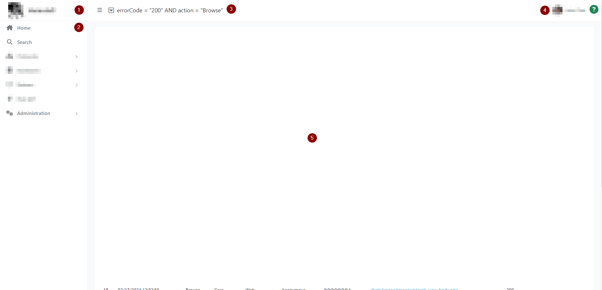
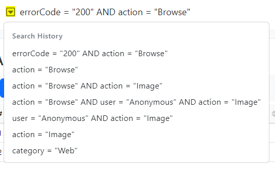
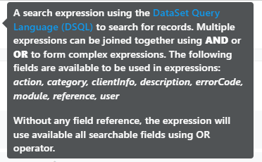

The application workspace is divided in a few areas:

1. The application name and logo (the logo is clickable and takes the user to the application home)
2. The navigation area on the left allows users to open various dashboards available in the application
3. The search area allows users to query the current dashboard and filter the data displayed in the content area
4. The section displays the following information:
    * background activity
    * user information
    * application help
5. The content area
   

_Figure 1. Typical view of an application dashboard_

The search filed has dropdown button which can display previous searches, up to 10 entries.

  
_Figure 1. Typical view of an a search history_

The search field also displays a tooltip, which is different for each dashboard, and it describes the format for the search expression (and a link to additional information) and available fields to be used in search expressions.

  
_Figure 1. Typical view of a search tooltip_